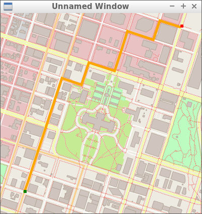

# CPP Route Planner Project
This project is based on [this](https://github.com/udacity/CppND-Route-Planning-Project) starter code from UDACITY. I left the comments from my Institute UDACITY as it is to know where were my contributions in this project. Here I applied the A Star Algorithm to find the path between two points on the map based on the open source library [IO2D](https://github.com/cpp-io2d/P0267_RefImpl/blob/master/BUILDING.md). This was written in the **route_planner.cpp**. Of course, the template unit tests given by the repo were used to validate the different methods in the project.
## Overflow
To build the project, please follow the instructions given in [this](https://github.com/udacity/CppND-Route-Planning-Project) link.  
For a successful run of the project for the route between the point (10, 10) and the point (90, 90), a window should be popped as follows:  
&nbsp;  
  
